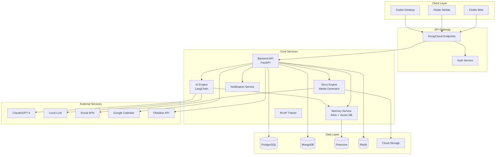
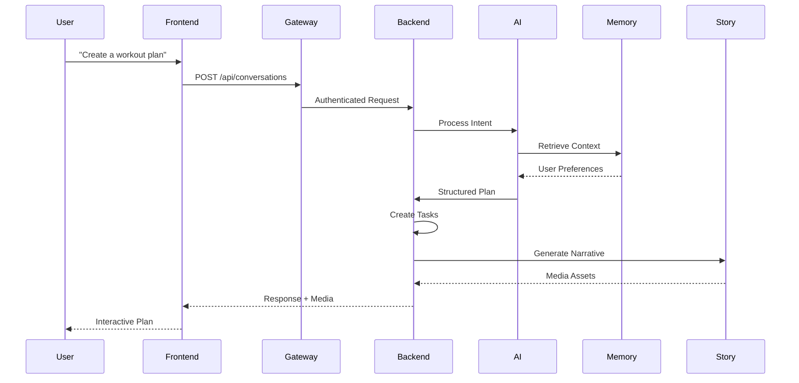
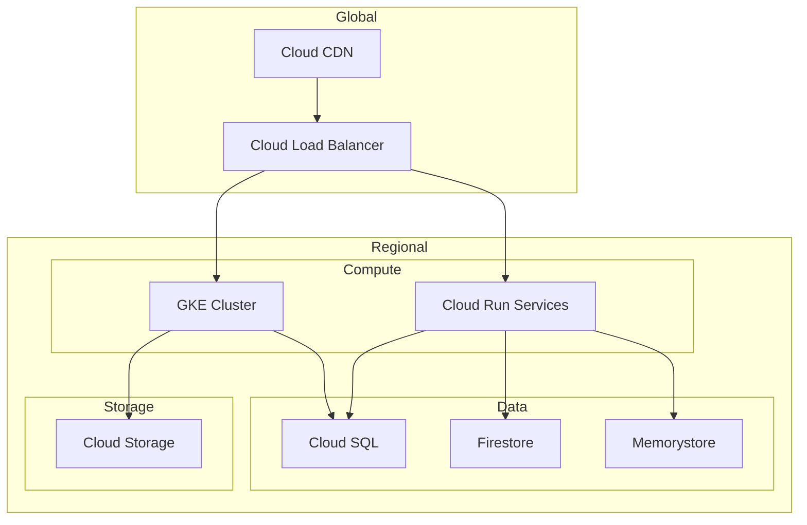
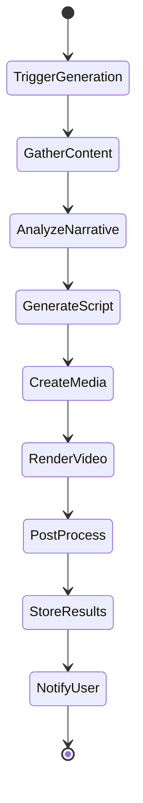

# SelfOS Architecture Document

## 1. Executive Summary

### System Overview
SelfOS is a personalized life operating system that combines conversational AI, task management, and automated storytelling to help users live more intentionally. The architecture is designed to scale from a single-user docker-compose deployment to a multi-tenant SaaS platform serving hundreds of thousands of users.

### Key Architectural Decisions
- **Privacy-First Design**: End-to-end encryption with AI-only data access
- **Scalable by Design**: Start with docker-compose, scale to Kubernetes on GCP
- **LLM Flexibility**: Multi-model support with local/cloud fallback strategies
- **Event-Driven Architecture**: Loosely coupled microservices for independent scaling
- **Media Pipeline**: Automated content generation for multiple platforms

### Technology Stack Summary
- **Frontend**: Flutter (Web, Mobile, Desktop)
- **Backend**: FastAPI (Python), Node.js for real-time features
- **AI/ML**: LangChain, Claude/GPT-4 APIs, Llama 2/Mistral (local)
- **Databases**: PostgreSQL, MongoDB, Pinecone, Redis
- **Infrastructure**: Docker → Kubernetes → GCP (Cloud Run, GKE)
- **Message Queue**: Redis Streams → Cloud Pub/Sub
- **Media Processing**: FFmpeg, Replicate API, Stable Diffusion

## 2. System Architecture

### 2.1 High-Level Architecture Diagram



### 2.2 Component Architecture

Each component follows a hexagonal architecture pattern with clear boundaries:

```
Component/
├── api/           # REST/GraphQL endpoints
├── domain/        # Business logic
├── adapters/      # External service adapters
├── repositories/  # Data access layer
└── events/        # Event publishers/subscribers
```

### 2.3 Data Flow Architecture



### 2.4 Deployment Architecture

#### Phase 1: Local Development (Docker Compose)
```yaml
version: '3.8'
services:
  frontend:
    build: ./apps/frontend
    ports: ["3000:3000"]
  
  backend:
    build: ./apps/backend-api
    environment:
      - DATABASE_URL=postgresql://...
      - LLM_MODE=local
    depends_on: [postgres, redis]
  
  ai-engine:
    build: ./apps/ai-engine
    volumes:
      - ./models:/models
  
  postgres:
    image: postgres:15
    volumes: ["postgres_data:/var/lib/postgresql/data"]
  
  redis:
    image: redis:7-alpine
  
  local-llm:
    image: ollama/ollama
    volumes: ["./models:/models"]
```

#### Phase 2: Production (Google Cloud)


## 3. Core Components

### 3.1 Frontend Layer (Flutter Multi-Platform)

**Architecture Pattern**: BLoC (Business Logic Component)

```dart
// Shared architecture across platforms
lib/
├── core/
│   ├── api/          # API client
│   ├── models/       # Data models
│   └── utils/        # Shared utilities
├── features/
│   ├── chat/         # Conversational UI
│   ├── tasks/        # Task management
│   ├── stories/      # Media viewer
│   └── settings/     # User preferences
└── platforms/
    ├── mobile/       # iOS/Android specific
    ├── web/          # Web specific
    └── desktop/      # Desktop specific
```

**Key Features**:
- Offline-first with local SQLite + sync
- End-to-end encryption using libsodium
- Platform-specific UI adaptations
- WebRTC for real-time features

### 3.2 API Gateway & Backend Services

**Backend API (FastAPI)**:
```python
# Main application structure
app/
├── api/
│   ├── v1/
│   │   ├── auth.py
│   │   ├── conversations.py
│   │   ├── tasks.py
│   │   └── stories.py
├── core/
│   ├── security.py    # E2E encryption
│   ├── config.py
│   └── events.py      # Event bus
├── services/
│   ├── ai_orchestrator.py
│   ├── task_manager.py
│   └── story_generator.py
└── models/
    ├── user.py
    ├── task.py
    └── conversation.py
```

**Security Layer**:
- OAuth 2.0 + JWT for authentication
- Row-level security in PostgreSQL
- Field-level encryption for sensitive data
- API rate limiting per user/tier

### 3.3 AI/ML Pipeline

**LLM Orchestration Strategy**:

```python
class LLMOrchestrator:
    def __init__(self):
        self.strategies = {
            'premium': CloudLLMStrategy(),      # Claude/GPT-4
            'standard': HybridLLMStrategy(),    # Mix of cloud/local
            'privacy': LocalLLMStrategy(),      # Llama 2/Mistral
            'offline': CachedLLMStrategy()      # Cached responses
        }
    
    async def process(self, request: ConversationRequest) -> Response:
        strategy = self._select_strategy(request.user_tier, request.privacy_mode)
        
        try:
            response = await strategy.generate(request)
        except CloudLLMException:
            # Fallback to local model
            response = await self.strategies['privacy'].generate(request)
        
        return response
```

**Model Options**:
1. **Cloud Models** (Primary):
   - Claude 3 Opus for complex reasoning
   - GPT-4 for creative content
   - Gemini for multimodal tasks

2. **Local Models** (Fallback/Privacy):
   - Llama 2 70B for general tasks
   - Mistral 7B for fast responses
   - Phi-2 for edge devices

3. **Specialized Models**:
   - Whisper for audio transcription
   - CLIP for image understanding
   - Stable Diffusion for image generation

### 3.4 Data Persistence Layer

**Multi-Database Strategy**:

```sql
-- PostgreSQL: Structured data
CREATE TABLE users (
    id UUID PRIMARY KEY,
    email_hash VARCHAR(64) UNIQUE,
    encrypted_profile JSONB,
    created_at TIMESTAMP WITH TIME ZONE
);

CREATE TABLE tasks (
    id UUID PRIMARY KEY,
    user_id UUID REFERENCES users(id),
    encrypted_content JSONB,
    life_area VARCHAR(50),
    status VARCHAR(20),
    due_date TIMESTAMP WITH TIME ZONE
);

-- MongoDB: Unstructured conversations
{
  "_id": "conversation_id",
  "user_id": "encrypted_user_id",
  "messages": [
    {
      "role": "user",
      "content": "encrypted_content",
      "timestamp": "2024-01-01T00:00:00Z",
      "attachments": ["media_ids"]
    }
  ],
  "metadata": {
    "life_areas": ["health", "career"],
    "sentiment": 0.8
  }
}

-- Pinecone: Vector embeddings
{
  "id": "memory_id",
  "values": [0.1, 0.2, ...],  // 1536-dim embedding
  "metadata": {
    "user_id": "encrypted_user_id",
    "type": "goal|task|reflection",
    "timestamp": "2024-01-01T00:00:00Z"
  }
}
```

### 3.5 Event-Driven Architecture

**Event Bus Design**:

```python
# Event types
class EventType(Enum):
    TASK_CREATED = "task.created"
    GOAL_ACHIEVED = "goal.achieved"
    STORY_GENERATED = "story.generated"
    REMINDER_DUE = "reminder.due"

# Event publisher
async def publish_event(event_type: EventType, payload: dict):
    # Development: Redis Streams
    await redis.xadd(f"events:{event_type.value}", payload)
    
    # Production: Google Pub/Sub
    publisher.publish(topic_path, json.dumps(payload).encode())

# Event consumers run as separate services
@event_handler(EventType.TASK_CREATED)
async def handle_task_created(payload):
    await notification_service.schedule_reminders(payload)
    await ai_engine.update_user_context(payload)
```

### 3.6 External Integrations

**Integration Architecture**:

```python
# Adapter pattern for external services
class IntegrationAdapter(ABC):
    @abstractmethod
    async def sync_tasks(self, user_id: str) -> List[Task]:
        pass
    
    @abstractmethod
    async def export_content(self, content: Story) -> str:
        pass

class ObsidianAdapter(IntegrationAdapter):
    async def export_content(self, content: Story):
        markdown = self._convert_to_markdown(content)
        await self._create_obsidian_note(markdown)

class InstagramAdapter(IntegrationAdapter):
    async def export_content(self, content: Story):
        media = await self._prepare_media(content)
        await self._post_to_instagram(media)
```

## 4. AI & Machine Learning Architecture

### 4.1 LLM Orchestration

**Prompt Engineering Pipeline**:

```python
class PromptPipeline:
    def __init__(self):
        self.templates = PromptTemplateRegistry()
        self.memory = MemoryRetriever()
        self.personalizer = PersonalizationEngine()
    
    async def build_prompt(self, request: Request) -> str:
        # 1. Retrieve relevant memories
        context = await self.memory.get_relevant_context(
            user_id=request.user_id,
            query=request.message,
            k=10
        )
        
        # 2. Get user personality profile
        profile = await self.personalizer.get_profile(request.user_id)
        
        # 3. Select and fill template
        template = self.templates.get(request.intent)
        
        return template.format(
            message=request.message,
            context=context,
            personality=profile,
            life_areas=request.user.life_areas
        )
```

### 4.2 Memory/RAG System Design

**Vector Database Schema**:

```python
# Memory types stored in Pinecone
class MemoryType(Enum):
    GOAL = "goal"                # Long-term aspirations
    ROUTINE = "routine"          # Daily/weekly patterns
    PREFERENCE = "preference"    # User preferences
    REFLECTION = "reflection"    # Journal entries
    ACHIEVEMENT = "achievement"  # Completed milestones

# Embedding pipeline
async def create_memory_embedding(content: str, metadata: dict):
    # 1. Generate embedding
    embedding = await openai.embeddings.create(
        input=content,
        model="text-embedding-3-large"
    )
    
    # 2. Store in Pinecone with metadata
    index.upsert(
        vectors=[{
            "id": str(uuid.uuid4()),
            "values": embedding.data[0].embedding,
            "metadata": {
                **metadata,
                "type": metadata["type"],
                "user_id": encrypt(metadata["user_id"]),
                "timestamp": datetime.utcnow().isoformat()
            }
        }]
    )
```

### 4.3 RLHF Training Pipeline

**Feedback Collection**:

```python
class RLHFTrainer:
    def __init__(self):
        self.feedback_queue = Queue()
        self.model_registry = ModelRegistry()
    
    async def collect_feedback(self, interaction: Interaction):
        feedback = {
            "prompt": interaction.prompt,
            "response": interaction.response,
            "rating": interaction.user_rating,
            "corrections": interaction.user_corrections,
            "context": interaction.context
        }
        
        await self.feedback_queue.put(feedback)
        
        # Trigger retraining after threshold
        if self.feedback_queue.size() > 1000:
            await self.trigger_training()
    
    async def trigger_training(self):
        # Fine-tune on Google Cloud Vertex AI
        dataset = await self.prepare_dataset()
        job = aiplatform.CustomTrainingJob(
            display_name="selfos-rlhf-training",
            script_path="train.py",
            container_uri="gcr.io/selfos/training:latest"
        )
        
        model = job.run(dataset=dataset)
        await self.model_registry.register(model)
```

### 4.4 Personalization Engine

**User Profile Learning**:

```python
@dataclass
class UserProfile:
    communication_style: str  # formal, casual, motivational
    peak_hours: List[int]    # Best times for productivity
    life_area_weights: Dict[str, float]  # Priority weights
    personality_traits: Dict[str, float]  # Big 5 traits
    motivation_triggers: List[str]  # What motivates them
    
class PersonalizationEngine:
    async def update_profile(self, user_id: str, interaction: Interaction):
        profile = await self.get_profile(user_id)
        
        # Update based on interaction patterns
        profile.communication_style = self._analyze_style(interaction)
        profile.peak_hours = self._analyze_activity_patterns(user_id)
        profile.life_area_weights = self._calculate_area_weights(user_id)
        
        # Store encrypted profile
        await self.store_profile(user_id, profile)
```

## 5. Data Architecture

### 5.1 Data Models & Schemas

**Core Domain Models**:

```python
# Shared models (libs/shared-models)
from pydantic import BaseModel
from typing import List, Optional, Dict
from datetime import datetime
from enum import Enum

class LifeArea(str, Enum):
    HEALTH = "health"
    CAREER = "career"
    RELATIONSHIPS = "relationships"
    CREATIVITY = "creativity"
    FINANCE = "finance"
    PERSONAL_GROWTH = "personal_growth"
    SPIRITUALITY = "spirituality"

class Task(BaseModel):
    id: str
    title: str
    description: Optional[str]
    life_areas: List[LifeArea]
    priority: int  # 1-5
    energy_required: int  # 1-5
    duration_minutes: int
    due_date: Optional[datetime]
    recurring_pattern: Optional[str]  # cron expression
    attachments: List[str]  # media IDs
    parent_goal_id: Optional[str]
    
class Goal(BaseModel):
    id: str
    title: str
    vision: str  # Why this matters
    life_areas: List[LifeArea]
    target_date: datetime
    milestones: List[Dict]
    success_metrics: List[str]
    inspiration_media: List[str]
```

### 5.2 Storage Strategy

**Data Distribution**:

| Data Type | Storage | Encryption | Backup |
|-----------|---------|------------|---------|
| User Profile | PostgreSQL | AES-256 at field level | Daily |
| Tasks/Goals | PostgreSQL | AES-256 at field level | Daily |
| Conversations | MongoDB | E2E encrypted | Daily |
| Media Files | Cloud Storage | AES-256 at rest | Weekly |
| Embeddings | Pinecone | Anonymized | Weekly |
| Cache | Redis | TLS only | None |
| Analytics | BigQuery | Aggregated only | Daily |

### 5.3 Caching Strategy

```python
# Multi-level caching
class CacheStrategy:
    def __init__(self):
        self.l1_cache = {}  # In-memory (per instance)
        self.l2_cache = Redis()  # Distributed
        self.l3_cache = CDN()  # Edge (for media)
    
    async def get(self, key: str, level: int = 2):
        # Try L1 first
        if level >= 1 and key in self.l1_cache:
            return self.l1_cache[key]
        
        # Try L2
        if level >= 2:
            value = await self.l2_cache.get(key)
            if value:
                self.l1_cache[key] = value
                return value
        
        return None

# Cache keys structure
# user:{user_id}:profile
# user:{user_id}:tasks:active
# user:{user_id}:memories:recent
# llm:response:{prompt_hash}
```

### 5.4 Data Privacy & Security

**Encryption Architecture**:

```python
class EncryptionService:
    def __init__(self):
        # User-specific keys derived from master key
        self.key_derivation = PBKDF2HMAC(
            algorithm=hashes.SHA256(),
            length=32,
            salt=os.environ['MASTER_SALT'].encode(),
            iterations=100000,
        )
    
    def encrypt_field(self, user_id: str, data: str) -> str:
        # Derive user-specific key
        user_key = self.key_derivation.derive(
            user_id.encode() + os.environ['MASTER_KEY'].encode()
        )
        
        # Encrypt with AES-256-GCM
        cipher = Cipher(
            algorithms.AES(user_key),
            modes.GCM(os.urandom(12))
        )
        
        encryptor = cipher.encryptor()
        ciphertext = encryptor.update(data.encode()) + encryptor.finalize()
        
        return base64.b64encode(
            cipher.iv + encryptor.tag + ciphertext
        ).decode()
```

**Data Access Patterns**:
- All personal data encrypted at rest
- Decryption only happens in memory
- AI services receive only encrypted user IDs
- No data export functionality (delete only)
- Audit logs for all data access

## 6. Media Processing Pipeline

### 6.1 Media Upload & Storage

```python
class MediaProcessor:
    async def process_upload(self, file: UploadFile, user_id: str):
        # 1. Validate file
        if not self._validate_file(file):
            raise InvalidFileError()
        
        # 2. Generate secure filename
        file_id = str(uuid.uuid4())
        extension = file.filename.split('.')[-1]
        
        # 3. Process based on type
        if file.content_type.startswith('image/'):
            processed = await self._process_image(file)
        elif file.content_type.startswith('video/'):
            processed = await self._process_video(file)
        elif file.content_type.startswith('audio/'):
            processed = await self._process_audio(file)
        
        # 4. Encrypt and store
        encrypted = await self.encrypt_media(processed, user_id)
        
        # 5. Store in Cloud Storage
        blob_name = f"users/{user_id}/media/{file_id}.{extension}"
        await self.storage.upload(blob_name, encrypted)
        
        # 6. Extract metadata for AI
        metadata = await self._extract_metadata(processed)
        
        return MediaObject(
            id=file_id,
            type=file.content_type,
            metadata=metadata,
            url=self._generate_signed_url(blob_name)
        )
```

### 6.2 Story Generation Workflow



```python
class StoryEngine:
    async def generate_story(self, user_id: str, period: str = "week"):
        # 1. Gather content from period
        content = await self._gather_content(user_id, period)
        
        # 2. Create narrative structure
        narrative = await self.ai_engine.create_narrative(
            tasks_completed=content.tasks,
            goals_progress=content.goals,
            media_items=content.media,
            user_profile=content.profile
        )
        
        # 3. Generate script
        script = await self._generate_script(narrative)
        
        # 4. Create visual assets
        assets = await self._create_assets(script)
        
        # 5. Render video
        video = await self._render_video(script, assets)
        
        # 6. Generate multiple formats
        formats = await self._export_formats(video, script)
        
        return StoryOutput(
            video_url=formats.video,
            instagram_url=formats.instagram,
            tiktok_url=formats.tiktok,
            blog_post=formats.blog,
            obsidian_note=formats.markdown
        )
```

### 6.3 Video Rendering Pipeline

```python
class VideoRenderer:
    def __init__(self):
        self.templates = VideoTemplateLibrary()
        self.ffmpeg = FFmpegWrapper()
        
    async def render(self, script: Script, assets: List[Asset]):
        # 1. Select template based on content type
        template = self.templates.select(
            style=script.style,
            duration=script.duration,
            platform=script.target_platform
        )
        
        # 2. Create timeline
        timeline = Timeline()
        
        for scene in script.scenes:
            timeline.add_clip(
                asset=assets[scene.asset_id],
                start=scene.start_time,
                duration=scene.duration,
                transitions=scene.transitions,
                effects=scene.effects
            )
            
            # Add text overlays
            if scene.text:
                timeline.add_text(
                    text=scene.text,
                    style=template.text_style,
                    position=scene.text_position
                )
        
        # 3. Add audio
        timeline.add_audio_track(
            background_music=template.music,
            voiceover=await self._generate_voiceover(script)
        )
        
        # 4. Render with FFmpeg
        output = await self.ffmpeg.render(
            timeline=timeline,
            resolution=template.resolution,
            fps=template.fps,
            codec=template.codec
        )
        
        return output
```

### 6.4 Social Media Export

```python
class SocialMediaExporter:
    async def export_to_platform(self, story: Story, platform: str):
        adapter = self.adapters[platform]
        
        # Platform-specific optimization
        optimized = await adapter.optimize_content(
            video=story.video,
            thumbnail=story.thumbnail,
            caption=story.caption,
            hashtags=story.hashtags
        )
        
        # Handle platform requirements
        if platform == "instagram":
            if optimized.duration > 60:
                # Split into multiple parts for carousel
                parts = await self._split_video(optimized.video)
                return await adapter.post_carousel(parts)
        
        elif platform == "tiktok":
            # Add trending sounds
            optimized.audio = await self._add_trending_audio(optimized)
        
        elif platform == "youtube":
            # Generate chapters
            optimized.chapters = await self._generate_chapters(story)
        
        # Post to platform
        result = await adapter.post(optimized)
        
        # Track performance
        await self.analytics.track_post(result)
        
        return result
```

## 7. Security Architecture

### 7.1 Authentication & Authorization

```python
# Multi-factor authentication flow
class AuthService:
    async def authenticate(self, credentials: Credentials):
        # 1. Validate primary credentials
        user = await self.validate_credentials(credentials)
        
        # 2. Check if MFA required
        if user.mfa_enabled:
            mfa_token = await self.send_mfa_challenge(user)
            return AuthResponse(
                status="mfa_required",
                mfa_token=mfa_token
            )
        
        # 3. Generate tokens
        access_token = self.generate_jwt(
            user_id=user.id,
            expires_in=timedelta(hours=1)
        )
        
        refresh_token = self.generate_refresh_token(
            user_id=user.id,
            expires_in=timedelta(days=30)
        )
        
        return AuthResponse(
            access_token=access_token,
            refresh_token=refresh_token
        )

# Role-based access control
class Permission(Enum):
    READ_OWN_DATA = "read:own_data"
    WRITE_OWN_DATA = "write:own_data"
    DELETE_OWN_DATA = "delete:own_data"
    ACCESS_AI_FEATURES = "access:ai_features"
    EXPORT_STORIES = "export:stories"

@require_permissions([Permission.READ_OWN_DATA])
async def get_user_tasks(user_id: str):
    # Endpoint logic
    pass
```

### 7.2 Data Encryption

**Encryption Layers**:

```python
# 1. Transport Layer (TLS 1.3)
ssl_context = ssl.create_default_context(ssl.Purpose.CLIENT_AUTH)
ssl_context.minimum_version = ssl.TLSVersion.TLSv1_3

# 2. Application Layer (E2E)
class E2EEncryption:
    def __init__(self):
        self.user_keys = {}  # Cached user public keys
    
    async def encrypt_for_user(self, user_id: str, data: bytes):
        # Get user's public key
        public_key = await self.get_user_public_key(user_id)
        
        # Generate ephemeral key pair
        ephemeral_private = PrivateKey.generate()
        ephemeral_public = ephemeral_private.public_key
        
        # ECDH key agreement
        shared_secret = ephemeral_private.exchange(public_key)
        
        # Derive encryption key
        derived_key = HKDF(
            algorithm=hashes.SHA256(),
            length=32,
            salt=None,
            info=b'selfos-e2e-encryption'
        ).derive(shared_secret)
        
        # Encrypt with AES-256-GCM
        return self._aes_encrypt(data, derived_key)

# 3. Storage Layer (At-rest)
class StorageEncryption:
    def encrypt_field(self, data: str, field_type: str):
        if field_type == "pii":
            # Strong encryption for PII
            return self._encrypt_with_hsm(data)
        elif field_type == "metadata":
            # Standard encryption for metadata
            return self._encrypt_with_kms(data)
```

### 7.3 API Security

```python
# API Gateway security policies
class SecurityMiddleware:
    async def __call__(self, request: Request, call_next):
        # 1. Rate limiting
        if not await self.rate_limiter.check(request):
            return JSONResponse(
                status_code=429,
                content={"error": "Rate limit exceeded"}
            )
        
        # 2. Input validation
        if not self.validate_input(request):
            return JSONResponse(
                status_code=400,
                content={"error": "Invalid input"}
            )
        
        # 3. CORS validation
        if not self.validate_cors(request):
            return JSONResponse(
                status_code=403,
                content={"error": "CORS policy violation"}
            )
        
        # 4. Request signing (for mobile apps)
        if request.headers.get("X-App-Platform") == "mobile":
            if not self.verify_request_signature(request):
                return JSONResponse(
                    status_code=401,
                    content={"error": "Invalid signature"}
                )
        
        # 5. Add security headers
        response = await call_next(request)
        response.headers["X-Content-Type-Options"] = "nosniff"
        response.headers["X-Frame-Options"] = "DENY"
        response.headers["Strict-Transport-Security"] = "max-age=31536000"
        
        return response
```

### 7.4 Compliance Considerations

**GDPR Compliance**:

```python
class GDPRCompliance:
    async def handle_data_request(self, user_id: str, request_type: str):
        if request_type == "access":
            # Generate data package (encrypted)
            data = await self.collect_user_data(user_id)
            return await self.encrypt_data_package(data)
        
        elif request_type == "deletion":
            # Right to be forgotten
            await self.delete_user_data(user_id)
            await self.delete_ai_memories(user_id)
            await self.delete_media_files(user_id)
            
            # Audit log (keep legally required minimum)
            await self.log_deletion(user_id)
            
        elif request_type == "portability":
            # Data portability (disabled by design)
            raise NotImplementedError(
                "Data export disabled for security. Only deletion available."
            )

# HIPAA Compliance for health data
class HIPAACompliance:
    def __init__(self):
        self.audit_logger = AuditLogger()
        
    async def log_access(self, user_id: str, accessor: str, data_type: str):
        await self.audit_logger.log({
            "timestamp": datetime.utcnow(),
            "user_id": self.hash_user_id(user_id),
            "accessor": accessor,
            "data_type": data_type,
            "action": "access"
        })
    
    def encrypt_health_data(self, data: dict):
        # Additional encryption layer for health data
        return self.fips_compliant_encryption(data)
```

## 8. Scalability & Performance

### 8.1 Horizontal Scaling Strategy

```yaml
# Kubernetes HPA configuration
apiVersion: autoscaling/v2
kind: HorizontalPodAutoscaler
metadata:
  name: backend-api-hpa
spec:
  scaleTargetRef:
    apiVersion: apps/v1
    kind: Deployment
    name: backend-api
  minReplicas: 3
  maxReplicas: 100
  metrics:
  - type: Resource
    resource:
      name: cpu
      target:
        type: Utilization
        averageUtilization: 70
  - type: Resource
    resource:
      name: memory
      target:
        type: Utilization
        averageUtilization: 80
  - type: Pods
    pods:
      metric:
        name: http_requests_per_second
      target:
        type: AverageValue
        averageValue: "1000"
```

**Service-Specific Scaling**:

```python
# AI Engine scaling strategy
class AIEngineScaler:
    def __init__(self):
        self.gpu_pool = GPUPool(min_instances=2, max_instances=50)
        self.cpu_pool = CPUPool(min_instances=10, max_instances=200)
        
    async def scale_for_request(self, request: AIRequest):
        if request.model_size > "7B":
            # Large models need GPU
            instance = await self.gpu_pool.acquire()
        else:
            # Small models can run on CPU
            instance = await self.cpu_pool.acquire()
            
        try:
            result = await instance.process(request)
        finally:
            await instance.release()
            
        return result
```

### 8.2 Caching Layers

**Multi-tier Caching Architecture**:

```python
# CDN Configuration (Cloud CDN)
cdn_config = {
    "cache_modes": {
        "static_assets": {
            "ttl": 86400,  # 24 hours
            "cache_keys": ["url", "device_type"]
        },
        "api_responses": {
            "ttl": 300,  # 5 minutes
            "cache_keys": ["url", "auth_token_hash", "accept_language"]
        },
        "media_files": {
            "ttl": 604800,  # 7 days
            "cache_keys": ["url", "quality"]
        }
    }
}

# Application-level caching
class CacheManager:
    def __init__(self):
        self.redis = Redis(
            connection_pool=ConnectionPool(
                max_connections=1000,
                decode_responses=True
            )
        )
        
    @cache(ttl=300)  # 5 minutes
    async def get_user_profile(self, user_id: str):
        return await self.db.get_user_profile(user_id)
    
    @cache(ttl=60)  # 1 minute
    async def get_active_tasks(self, user_id: str):
        return await self.db.get_active_tasks(user_id)
    
    async def invalidate_user_cache(self, user_id: str):
        pattern = f"cache:user:{user_id}:*"
        for key in self.redis.scan_iter(match=pattern):
            self.redis.delete(key)
```

### 8.3 Performance Monitoring

```python
# Distributed tracing with OpenTelemetry
from opentelemetry import trace
from opentelemetry.exporter.cloud_trace import CloudTraceSpanExporter

tracer = trace.get_tracer(__name__)

class PerformanceMonitor:
    @tracer.start_as_current_span("api_request")
    async def track_request(self, request: Request):
        span = trace.get_current_span()
        
        # Add attributes
        span.set_attribute("http.method", request.method)
        span.set_attribute("http.url", str(request.url))
        span.set_attribute("user.tier", request.user.tier)
        
        # Track database queries
        with tracer.start_as_current_span("database_query"):
            result = await self.db.query(request.query)
            
        # Track AI processing
        with tracer.start_as_current_span("ai_processing"):
            ai_result = await self.ai.process(result)
            
        return ai_result

# Performance metrics collection
class MetricsCollector:
    def __init__(self):
        self.metrics = {
            "request_duration": Histogram(
                "http_request_duration_seconds",
                "HTTP request latency"
            ),
            "ai_inference_time": Histogram(
                "ai_inference_duration_seconds",
                "AI model inference time"
            ),
            "cache_hit_rate": Counter(
                "cache_hits_total",
                "Number of cache hits"
            )
        }
```

### 8.4 Load Balancing

```yaml
# Google Cloud Load Balancer configuration
apiVersion: networking.k8s.io/v1
kind: Ingress
metadata:
  name: selfos-ingress
  annotations:
    kubernetes.io/ingress.class: "gce"
    kubernetes.io/ingress.global-static-ip-name: "selfos-ip"
    networking.gke.io/managed-certificates: "selfos-cert"
    cloud.google.com/backend-config: '{"default": "selfos-backend-config"}'
spec:
  rules:
  - host: api.selfos.com
    http:
      paths:
      - path: /api/v1/*
        pathType: ImplementationSpecific
        backend:
          service:
            name: backend-api
            port:
              number: 8000
      - path: /ai/*
        pathType: ImplementationSpecific
        backend:
          service:
            name: ai-engine
            port:
              number: 8001
```

## 9. Development & Deployment

### 9.1 CI/CD Pipeline

```yaml
# .github/workflows/deploy.yml
name: Deploy to GCP

on:
  push:
    branches: [main, staging]

jobs:
  test:
    runs-on: ubuntu-latest
    steps:
      - uses: actions/checkout@v3
      
      - name: Run tests
        run: |
          docker-compose -f docker-compose.test.yml up --abort-on-container-exit
          
      - name: Security scan
        run: |
          trivy scan --severity HIGH,CRITICAL .
          
  build:
    needs: test
    runs-on: ubuntu-latest
    steps:
      - name: Build and push images
        env:
          GCP_PROJECT: ${{ secrets.GCP_PROJECT }}
        run: |
          # Build all services
          for service in backend-api ai-engine memory-service story-engine; do
            docker build -t gcr.io/$GCP_PROJECT/$service:$GITHUB_SHA apps/$service
            docker push gcr.io/$GCP_PROJECT/$service:$GITHUB_SHA
          done
          
  deploy:
    needs: build
    runs-on: ubuntu-latest
    steps:
      - name: Deploy to Cloud Run
        if: github.ref == 'refs/heads/main'
        run: |
          gcloud run deploy backend-api \
            --image gcr.io/$GCP_PROJECT/backend-api:$GITHUB_SHA \
            --region us-central1 \
            --platform managed \
            --memory 2Gi \
            --cpu 2 \
            --min-instances 3 \
            --max-instances 100 \
            --concurrency 1000
```

### 9.2 Environment Strategy

```python
# Environment configuration
class Environment(Enum):
    LOCAL = "local"
    DEV = "development"
    STAGING = "staging"
    PROD = "production"

class Config:
    def __init__(self, env: Environment):
        self.env = env
        self.settings = self._load_settings()
        
    def _load_settings(self):
        base_settings = {
            "debug": self.env != Environment.PROD,
            "log_level": "DEBUG" if self.env == Environment.LOCAL else "INFO",
            "database_pool_size": 5 if self.env == Environment.LOCAL else 50,
            "cache_ttl": 60 if self.env == Environment.DEV else 300,
            "ai_timeout": 30 if self.env == Environment.LOCAL else 120
        }
        
        # Environment-specific overrides
        env_settings = {
            Environment.LOCAL: {
                "database_url": "postgresql://localhost/selfos_dev",
                "redis_url": "redis://localhost:6379",
                "llm_provider": "local",
                "storage_backend": "filesystem"
            },
            Environment.PROD: {
                "database_url": Secret("prod-database-url"),
                "redis_url": Secret("prod-redis-url"),
                "llm_provider": "claude",
                "storage_backend": "gcs"
            }
        }
        
        return {**base_settings, **env_settings[self.env]}
```

### 9.3 Monitoring & Observability

```python
# Comprehensive monitoring setup
class ObservabilityStack:
    def __init__(self):
        self.init_logging()
        self.init_metrics()
        self.init_tracing()
        self.init_profiling()
        
    def init_logging(self):
        # Structured logging with Cloud Logging
        import google.cloud.logging
        client = google.cloud.logging.Client()
        client.setup_logging()
        
        # Custom formatter
        class StructuredFormatter(logging.Formatter):
            def format(self, record):
                log_obj = {
                    "severity": record.levelname,
                    "message": record.getMessage(),
                    "timestamp": datetime.utcnow().isoformat(),
                    "source": {
                        "file": record.pathname,
                        "line": record.lineno,
                        "function": record.funcName
                    }
                }
                
                if hasattr(record, 'user_id'):
                    log_obj["user_id"] = record.user_id
                    
                if hasattr(record, 'trace_id'):
                    log_obj["trace_id"] = record.trace_id
                    
                return json.dumps(log_obj)
    
    def init_metrics(self):
        # Prometheus metrics
        self.metrics = {
            "http_requests": Counter(
                "http_requests_total",
                "Total HTTP requests",
                ["method", "endpoint", "status"]
            ),
            "response_time": Histogram(
                "http_response_time_seconds",
                "HTTP response time",
                ["method", "endpoint"]
            ),
            "active_users": Gauge(
                "active_users_total",
                "Number of active users"
            ),
            "ai_tokens_used": Counter(
                "ai_tokens_total",
                "Total AI tokens consumed",
                ["model", "operation"]
            )
        }
    
# Alert configuration
alerts = {
    "high_error_rate": {
        "condition": "rate(http_requests_total{status=~'5..'}[5m]) > 0.05",
        "duration": "5m",
        "severity": "critical",
        "notification": ["pagerduty", "slack"]
    },
    "ai_latency": {
        "condition": "histogram_quantile(0.95, ai_inference_duration_seconds) > 10",
        "duration": "10m",
        "severity": "warning",
        "notification": ["slack"]
    },
    "database_connections": {
        "condition": "pg_stat_database_numbackends > 80",
        "duration": "5m",
        "severity": "warning",
        "notification": ["slack"]
    }
}
```

### 9.4 Disaster Recovery

```python
# Backup and recovery strategy
class DisasterRecovery:
    def __init__(self):
        self.backup_schedule = {
            "postgresql": "0 2 * * *",  # Daily at 2 AM
            "mongodb": "0 3 * * *",     # Daily at 3 AM
            "user_media": "0 4 * * 0",  # Weekly on Sunday
            "vector_db": "0 5 * * *"    # Daily at 5 AM
        }
        
    async def backup_postgresql(self):
        # Point-in-time recovery enabled
        backup_cmd = f"""
        pg_dump {self.db_url} | \
        gzip | \
        gsutil cp - gs://selfos-backups/postgres/backup-{timestamp}.sql.gz
        """
        
        # Keep 30 days of daily backups
        # Keep 12 months of monthly backups
        # Keep 7 years of yearly backups
        
    async def restore_postgresql(self, backup_date: str):
        # Download and restore
        restore_cmd = f"""
        gsutil cp gs://selfos-backups/postgres/backup-{backup_date}.sql.gz - | \
        gunzip | \
        psql {self.db_url}
        """
        
    # RTO (Recovery Time Objective): 4 hours
    # RPO (Recovery Point Objective): 24 hours
```

## 10. Technology Decisions

### 10.1 Programming Languages & Frameworks

| Component | Language | Framework | Justification |
|-----------|----------|-----------|---------------|
| Frontend | Dart | Flutter 3.x | Single codebase for all platforms |
| Backend API | Python 3.11+ | FastAPI | Async support, type hints, fast |
| AI Engine | Python 3.11+ | LangChain | Best AI/ML ecosystem |
| Story Engine | Python/Node.js | Custom + FFmpeg | Media processing capabilities |
| RLHF Trainer | Python 3.11+ | PyTorch + Transformers | Industry standard for ML |
| Real-time | Node.js | Socket.io | WebSocket support |
| Scripts/Tools | Go | None | Fast CLI tools |

### 10.2 Database Choices

| Use Case | Database | Justification |
|----------|----------|---------------|
| User data, tasks | PostgreSQL 15 | ACID, JSON support, RLS |
| Conversations | MongoDB 6 | Flexible schema, time-series |
| Vector search | Pinecone | Managed, scalable, fast |
| Cache | Redis 7 | In-memory, pub/sub support |
| Analytics | BigQuery | Serverless, SQL, ML features |
| Media metadata | Cloud Firestore | Real-time sync, offline support |

### 10.3 Infrastructure Choices

| Component | Choice | Alternative | Justification |
|-----------|--------|-------------|---------------|
| Container runtime | Docker | Podman | Industry standard |
| Orchestration | Kubernetes | Nomad | GKE integration |
| Service mesh | Istio | Linkerd | Advanced features |
| API Gateway | Kong | Envoy | Plugin ecosystem |
| Message queue | Cloud Pub/Sub | Kafka | Managed, scalable |
| CDN | Cloud CDN | Cloudflare | GCP integration |

### 10.4 Third-Party Services

| Service | Provider | Purpose | Fallback |
|---------|----------|---------|----------|
| Primary LLM | Anthropic Claude | Complex reasoning | GPT-4 |
| Secondary LLM | OpenAI GPT-4 | Creative content | Local LLM |
| Local LLM | Ollama | Privacy mode | Cached responses |
| Email | SendGrid | Notifications | Cloud Functions |
| SMS | Twilio | MFA | Email OTP |
| Video processing | Replicate | AI video generation | Local FFmpeg |
| Image generation | Stable Diffusion | Story visuals | DALL-E 3 |
| Speech synthesis | ElevenLabs | Natural voices | Google TTS |
| Social APIs | Native SDKs | Direct posting | Buffer API |

---

## Appendix A: Development Setup

```bash
# Clone repository
git clone https://github.com/selfos/selfos.git
cd selfos

# Install dependencies
npm install -g nx
npm install

# Setup environment
cp .env.example .env.local
# Edit .env.local with your credentials

# Start local development
docker-compose up -d
nx serve backend-api
nx serve frontend

# Run tests
nx test-all
```

## Appendix B: API Examples

```python
# Example API usage
POST /api/v1/conversations
{
  "message": "I want to start exercising regularly",
  "context": {
    "life_areas": ["health"],
    "current_mood": "motivated",
    "available_time": 30
  }
}

Response:
{
  "conversation_id": "uuid",
  "ai_response": "Great initiative! Based on your schedule...",
  "created_tasks": [
    {
      "id": "uuid",
      "title": "Morning 15-min workout",
      "scheduled_time": "07:00",
      "recurrence": "daily"
    }
  ],
  "media_suggestions": [
    {
      "type": "video",
      "url": "...",
      "title": "Beginner home workout"
    }
  ]
}
```

## Appendix C: Security Checklist

- [ ] All data encrypted at rest (AES-256)
- [ ] All connections use TLS 1.3
- [ ] API rate limiting enabled
- [ ] Input validation on all endpoints
- [ ] SQL injection prevention (parameterized queries)
- [ ] XSS prevention (content security policy)
- [ ] CSRF tokens for state-changing operations
- [ ] Security headers configured
- [ ] Regular dependency updates
- [ ] Penetration testing quarterly
- [ ] Security audit annually
- [ ] Incident response plan documented
- [ ] Data breach notification process
- [ ] GDPR compliance verified
- [ ] HIPAA compliance for health data

---

*Last updated: 2025*
*Version: 1.0*