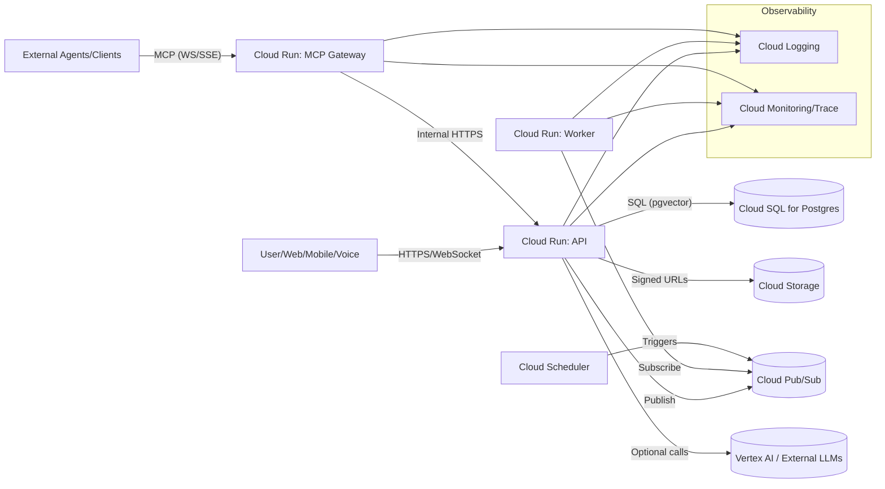
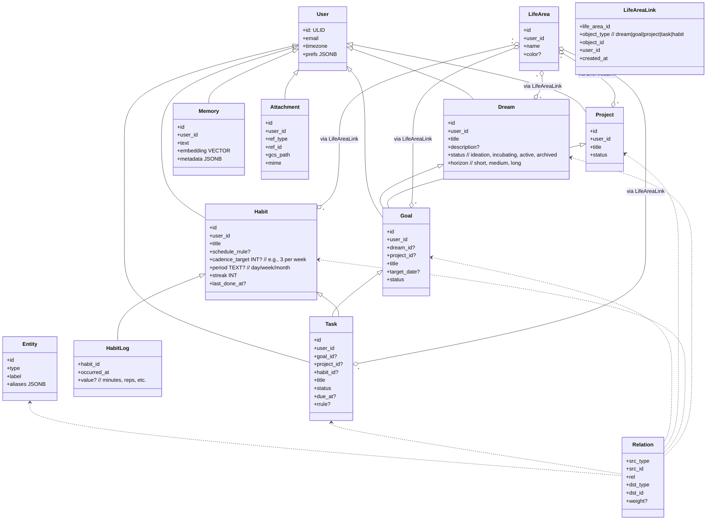
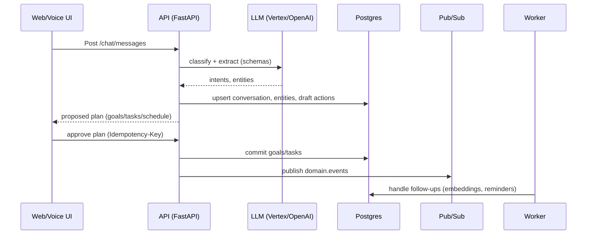
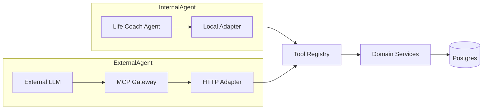
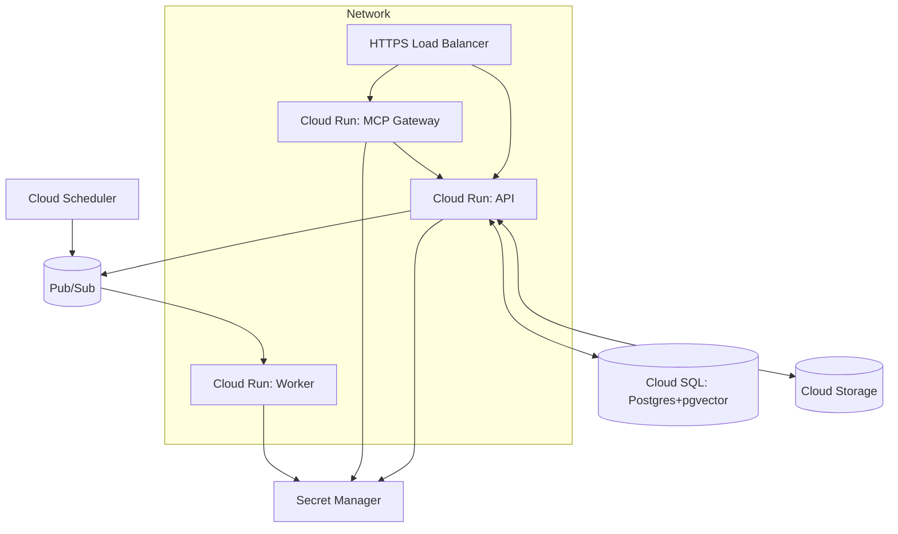

# SelfOS Next — Architecture (v0.1, Serverless-First on GCP)

Purpose: A lean, serverless architecture to manage, track, and reflect on life — goals, projects, tasks, entities (people/places/things), memories — with a conversational, AI-powered Life Coach agent. Minimizes cost and complexity while preserving a path to scale.

Status: Initial proposal for discussion. Focused on MVP-first with clear evolution paths.

---

## 1. Objectives & Principles

- Unified Life OS: conversational capture, intelligent planning, day-to-day execution, and reflective storytelling.
- Serverless and cost-aware: Cloud Run, Cloud SQL (Postgres+pgvector), Pub/Sub, GCS.
- Modular monolith now; clean boundaries for later service extraction.
- Privacy and trust: explicit approvals, scopes for agents, strong audit trail.
- Reliability: at-least-once processing, idempotency keys, dead-letter queues.

Non-functional targets
- Availability: 99.9% (MVP) via Cloud Run + managed GCP services
- P95 API latency: < 400 ms for CRUD; AI endpoints dominated by provider latency
- Cost guardrails: autoscale-to-zero for non-traffic; model budget caps per user

---

## 2. High-Level Architecture



Key simplifications
- Split API (FastAPI) and MCP Gateway into separate Cloud Run services; MCP calls API over internal HTTPS.
- One Worker service handles background jobs via Pub/Sub.
- One database (Postgres) for transactional data and vectors (pgvector).
- One object store (GCS) for media attachments via signed URLs.
- Pub/Sub replaces Redis Streams; scale-to-zero and pay-per-use.

---

## 3. Core Domains & Data Model

Domains (Expanded)
- Life Areas: high-level dimensions (Health, Relationships, Finance, Creativity, etc.). Everything must belong to at least one life area to enable balance tracking.
- Dreams: aspirational, directional outcomes (often vague/time-flexible) that may spawn concrete goals later.
- Goals: concrete, measurable outcomes (time-bound), may be linked to a dream and/or a project.
- Habits: ongoing behaviors with cadence (e.g., 3x/week) and streaks; distinct from goals; can generate check-ins/tasks.
- Projects: vehicles for execution that group goals and tasks; tasks may also be standalone.
- Tasks: actionable items; may link to a goal, project, habit, or stand alone. Support dependencies and recurrence.
- Knowledge Graph: Entities (Person/Place/Org/Resource/Concept) and relations between any domain object and entity.
- Conversation: Threads, messages, extracted intents/entities, proposed actions.
- Memory: Text, embeddings, metadata, entity links.
- Media: Attachments stored in GCS, linkable to any domain object.
- Agents: Life Coach and future agents; runs, scopes, decisions.
- Audit: Append-only events for sensitive actions and tool calls.

Key principles
- Non-strict hierarchy: tasks can exist without a project; goals may not have a project; dreams can exist without immediate goals.  
- Life area membership: many-to-many between life areas and all core objects (dream, goal, project, task, habit). Enforced via application policy (creation requires at least one area; if unknown, the system proposes one and requests confirmation).

Entity overview


Schema notes
- ULIDs for IDs and time-ordered indexing.  
- Many-to-many life area membership via `core.life_area_links` (object_type, object_id).  
- `core.tasks` supports optional `project_id`, `goal_id`, and `habit_id` to allow standalone and linked tasks.  
- Habits capture cadence (target per period) and logs (check-ins) to compute streaks.  
- Graph relations remain in adjacency tables (graph.nodes, graph.edges) for cross-domain/entity linking.

Example DDL (excerpt)
```sql
-- core.life_areas
CREATE TABLE core.life_areas (
  id TEXT PRIMARY KEY,
  user_id TEXT NOT NULL REFERENCES core.users(id),
  name TEXT NOT NULL,
  color TEXT NULL,
  created_at TIMESTAMPTZ NOT NULL DEFAULT now()
);
CREATE UNIQUE INDEX ux_life_areas_user_name ON core.life_areas(user_id, name);

-- core.life_area_links (polymorphic link)
CREATE TABLE core.life_area_links (
  life_area_id TEXT NOT NULL REFERENCES core.life_areas(id) ON DELETE CASCADE,
  user_id TEXT NOT NULL,
  object_type TEXT NOT NULL CHECK (object_type IN ('dream','goal','project','task','habit')),
  object_id TEXT NOT NULL,
  created_at TIMESTAMPTZ NOT NULL DEFAULT now(),
  PRIMARY KEY (life_area_id, object_type, object_id)
);
CREATE INDEX ix_lal_user_object ON core.life_area_links(user_id, object_type, object_id);

-- core.dreams
CREATE TABLE core.dreams (
  id TEXT PRIMARY KEY,
  user_id TEXT NOT NULL REFERENCES core.users(id),
  title TEXT NOT NULL,
  description TEXT NULL,
  status TEXT NOT NULL DEFAULT 'incubating',
  horizon TEXT NULL,
  created_at TIMESTAMPTZ NOT NULL DEFAULT now(),
  updated_at TIMESTAMPTZ NOT NULL DEFAULT now()
);

-- core.goals
CREATE TABLE core.goals (
  id TEXT PRIMARY KEY,
  user_id TEXT NOT NULL REFERENCES core.users(id),
  dream_id TEXT NULL REFERENCES core.dreams(id) ON DELETE SET NULL,
  project_id TEXT NULL REFERENCES core.projects(id) ON DELETE SET NULL,
  title TEXT NOT NULL,
  description TEXT NULL,
  target_date TIMESTAMPTZ NULL,
  status TEXT NOT NULL DEFAULT 'active',
  created_at TIMESTAMPTZ NOT NULL DEFAULT now(),
  updated_at TIMESTAMPTZ NOT NULL DEFAULT now()
);
CREATE INDEX ix_goals_user_created ON core.goals(user_id, created_at DESC);

-- core.habits
CREATE TABLE core.habits (
  id TEXT PRIMARY KEY,
  user_id TEXT NOT NULL REFERENCES core.users(id),
  title TEXT NOT NULL,
  schedule_rrule TEXT NULL,
  cadence_target INT NULL,
  period TEXT NULL CHECK (period IN ('day','week','month')),
  streak INT NOT NULL DEFAULT 0,
  last_done_at TIMESTAMPTZ NULL,
  created_at TIMESTAMPTZ NOT NULL DEFAULT now(),
  updated_at TIMESTAMPTZ NOT NULL DEFAULT now()
);

CREATE TABLE core.habit_logs (
  habit_id TEXT NOT NULL REFERENCES core.habits(id) ON DELETE CASCADE,
  occurred_at TIMESTAMPTZ NOT NULL,
  value NUMERIC NULL,
  note TEXT NULL,
  PRIMARY KEY (habit_id, occurred_at)
);

-- core.tasks (standalone or linked)
CREATE TABLE core.tasks (
  id TEXT PRIMARY KEY,
  user_id TEXT NOT NULL REFERENCES core.users(id),
  goal_id TEXT NULL REFERENCES core.goals(id) ON DELETE SET NULL,
  project_id TEXT NULL REFERENCES core.projects(id) ON DELETE SET NULL,
  habit_id TEXT NULL REFERENCES core.habits(id) ON DELETE SET NULL,
  title TEXT NOT NULL,
  description TEXT NULL,
  status TEXT NOT NULL DEFAULT 'pending',
  due_at TIMESTAMPTZ NULL,
  rrule TEXT NULL,
  effort_minutes INT NULL,
  created_at TIMESTAMPTZ NOT NULL DEFAULT now(),
  updated_at TIMESTAMPTZ NOT NULL DEFAULT now()
);
CREATE INDEX ix_tasks_user_status ON core.tasks(user_id, status);

-- memory.memories with pgvector
CREATE EXTENSION IF NOT EXISTS vector;
CREATE TABLE memory.memories (
  id TEXT PRIMARY KEY,
  user_id TEXT NOT NULL REFERENCES core.users(id),
  text TEXT NOT NULL,
  embedding vector(1536),
  metadata JSONB NOT NULL DEFAULT '{}',
  created_at TIMESTAMPTZ NOT NULL DEFAULT now()
);
CREATE INDEX ix_mem_user_created ON memory.memories(user_id, created_at DESC);
CREATE INDEX ix_mem_embedding ON memory.memories USING ivfflat (embedding vector_cosine_ops);
```

---

## 4. Conversational Ingestion & Planning

Pipeline (per message)
1) Safety & PII pass (basic)  
2) Intent classification (LLM tool-calling) — intents include dream, goal, habit, project, task, note  
3) Entity extraction (schema-constrained) — extract life area(s), people, places, resources  
4) Dedup and link to graph; assign life area(s) (ask user if uncertain)  
5) Planner branches by type:  
   - Dream → create dream; optionally propose candidate goals  
   - Goal → create goal; propose starter tasks/schedule  
   - Habit → create habit; propose cadence and first check-ins  
   - Project → create project; propose initial goals/tasks  
   - Task → create standalone task; propose linking to goal/project if relevant  
6) Draft commands returned for user confirmation  
7) On approval → commit changes; emit events; update memory/embeddings; create life area links



Prompting
- Versioned prompt templates; unit “golden tests” for classification/extraction.
- Budget-aware provider selection: Gemini Flash for classify/extract; stronger models for stories.
- Schema emphasizes distinction between dream (aspirational, non-time-bound) and goal (measurable, time-bound). Habits carry cadence fields.

---

## 5. Agents Architecture (Life Coach First)

Agent Host (Worker)
- Runs as Cloud Run service subscribed to Pub/Sub topics.
- Receives: conversation events, schedule ticks, explicit commands.
- Produces: domain commands (create/update), stories, reminders.

Agent Loop
1) Load context: recent messages, life area coverage metrics, dreams/goals/projects/tasks, habits with streaks, entities, memories
2) Reason: propose plan or adjustments oriented to life area balance (e.g., neglected areas) and user horizon
3) Policy checks: scopes, risk, rate limits, user preferences
4) Emit draft or execute (depending on policy/UI setting)
5) Persist AgentRun (inputs, outputs, tool calls, costs)

Agent tools (internal calls)
- Work: list/get/create/update dreams/goals/projects/tasks; compute schedule
- Entities: find/link entities; update graph relations
- Memory: record/search memories; attach to entities/goals
- Story: generate summaries/retrospectives for timeframe or entity
- Habits: create habit, log check-in, compute streaks; generate next check-ins
- Life Areas: assign/unassign life areas; compute balance; suggest attention areas

Idempotency & Reliability
- All write commands carry `command_id` (Idempotency-Key).  
- Worker deduplicates by `command_id` to ensure at-least-once safety.

### 5.1 Unified Tooling Layer (Agents + MCP)

Goal: ensure internal AI agents and external MCP clients use the exact same capabilities and contracts.

Components
- Tool Contracts: Pydantic models (inputs/outputs) and semantic descriptions.
- Tool Registry: in-process registry that binds tool names → domain service functions.
- Adapters:
  - Local Adapter (in-process) for internal agents (Life Coach) calling domain services directly.
  - HTTP Adapter used by MCP Gateway to call API endpoints (service-to-service auth).
- Policy & Scopes: shared authorization layer applied before tool execution.
- Audit Hooks: shared instrumentation records AgentRun and audit events.



Execution flow
1) Agent (internal or external via MCP) invokes a tool with a tool contract payload.  
2) Adapter (Local or HTTP) validates payload against Pydantic schema.  
3) Policy checks scopes and risk (e.g., bulk deletes require confirmation).  
4) Tool Registry dispatches to domain service method (idempotent command).  
5) Results pass through audit hooks (AgentRun + audit.events) and are returned.

Benefits
- Single source of truth for tool shapes and behavior.  
- External agents cannot bypass API rules; internal agents are efficient while sharing the same contracts.  
- MCP JSON schemas are generated from the same Pydantic models (no drift).

---

## 6. MCP Server (External Agent Access)

Why MCP
- Standardized tool interface for LLM agents with explicit permissions.

MVP approach (separate service)
- Dedicated MCP Gateway on Cloud Run (WS/SSE capable).  
- Uses the same Tool Contracts and routes through the Tool Registry via the HTTP Adapter (calls API endpoints over internal HTTPS).  
- Gateway does not access the database directly; it invokes API using service-to-service auth.  
- Exposes tools backed by domain services with per-agent scopes and quotas.

Representative tools
- `list_tasks(filter)` / `get_task(id)` / `create_task(...)` / `update_task_status(...)`
- `get_goal(id)` / `create_goal(...)` / `plan_goal(...)`
- `get_dream(id)` / `create_dream(...)` / `promote_dream_to_goal(dream_id, ...)`
- `create_habit(...)` / `log_habit(habit_id, occurred_at, value?)` / `list_habits(filter)`
- `assign_life_area(ref, life_area_id)` / `compute_life_balance()`
- `find_entities(query)` / `link_entity(...)`
- `search_memories(query)` / `record_memory(...)`
- `generate_story(target, style)`

Audit & Security
- Service-to-service auth: MCP uses IAM/identity tokens to call API; API validates audience and scopes.  
- Each tool call logged to `agent.runs` and `audit.events`.  
- Scopes restrict accessible resources; rate-limits and budgets per agent.

---

## 7. Events & Background Processing

Outbox pattern
- DB transaction writes to `outbox` table; a publisher pushes rows to Pub/Sub topics.

Topics (MVP)
- `domain.events` — entity changes (task.created, goal.completed, entity.linked)
- `agent.commands` — requests for agent work (plan, reflect, remind)
- `story.generate` — generate story for timeframe/entity
- `media.ingest` — post-upload OCR/EXIF/thumbnail
- `schedule.tick` — periodic triggers (daily planning)

Delivery
- Pub/Sub → Cloud Run Worker; retry with exponential backoff; DLQ topics on poison messages.

---

## 8. Web & Voice Interfaces

Web (Next.js + TS)
- Pages: Inbox (chat/voice), Work (projects/goals/tasks), Entities (graph), Attachments, Agents, Stories.
- Data: OpenAPI client + React Query; WebSocket/SSE for live updates.

Voice
- STT: Google Cloud Speech-to-Text (streaming for near-real-time).  
- TTS: Google Cloud Text-to-Speech with user-selectable voice.

Attachments
- Signed PUT/GET URLs to GCS; metadata pipeline via `media.ingest` topic.

---

## 9. Storytelling & Social Export

Story engine
- Inputs: timeframe (week/month) or entity (goal/project/person) + style (journalistic, cinematic, playful).
- Outputs: Markdown (primary), HTML; image sequences optional.

Social integrations (MVP outline)
- Instagram/Facebook via Facebook Graph + Instagram Graph APIs.  
- User connects FB Page/IG Business/Creator account.  
- We generate assets and publish only after explicit user action (no auto-post without consent).  
- Store tokens in DB encrypted; refresh securely; strict scopes.

---

## 10. Security, Privacy, Compliance

AuthN/Z
- OAuth (Google) for login; JWT for API; device-bound refresh later.
- Per-agent scopes for MCP and internal agents.

Data safety
- TLS everywhere; encryption at rest (Cloud SQL, GCS).  
- Data export/delete endpoints; PII redaction options; audit trail for sensitive actions.

Secrets
- Secret Manager for API keys; services use Workload Identity; no secrets in repo.

Policy
- “High impact” actions (delete, bulk changes, external posts) require user confirmation.

---

## 11. Observability & Cost Controls

Observability
- Structured JSON logs with trace/request/agent IDs.  
- OTEL exporters → Cloud Trace; Prometheus-format metrics → Cloud Monitoring.

Cost
- Cloud Run min instances = 0; autoscale on demand.  
- Pub/Sub pay-per-use; Cloud Scheduler minimal cadence.  
- Cloud SQL small instance first; pgvector indexes sized cautiously.  
- LLM budgets per user; prefer fast/cheap models (Gemini Flash) for classify/extract.

---

## 12. Deployment (GCP)



Infra notes
- Serverless VPC Access for Cloud Run (API, MCP, Worker) to reach Cloud SQL privately.  
- MCP→API service-to-service auth via IAM: use identity tokens with verified audience and per-route scopes.  
- Artifact Registry for images; IaC via Terraform (recommended).  
- DB migrations run as one-off job on deploy; backup + PITR enabled.

---

## 13. Evolution Paths

- Extract MCP to its own service when load or security isolation demands.
- Move graph queries to a dedicated search/graph service if complexity grows.
- Introduce additional agents (fitness, finance) as separate worker groups.
- Add integration connectors (calendar, health, finance) as on-demand modules.

---

## 14. Appendix — Message Contracts (Sketch)

Pub/Sub `domain.events` payload (example)
```json
{
  "event_id": "01JABC...",
  "type": "task.created",
  "user_id": "01JA...",
  "ts": "2025-01-01T12:34:56Z",
  "entity": {"id": "01T...", "title": "Practice piano", "due_at": null}
}
```

Write API requires header
```
Idempotency-Key: 01JXYZ...
```

MCP tool example (create_task)
```json
{
  "name": "create_task",
  "input": {
    "title": "Practice scales", "goal_id": "01G...",
    "due_at": "2025-01-03T09:00:00Z", "labels": ["music"]
  }
}
```
