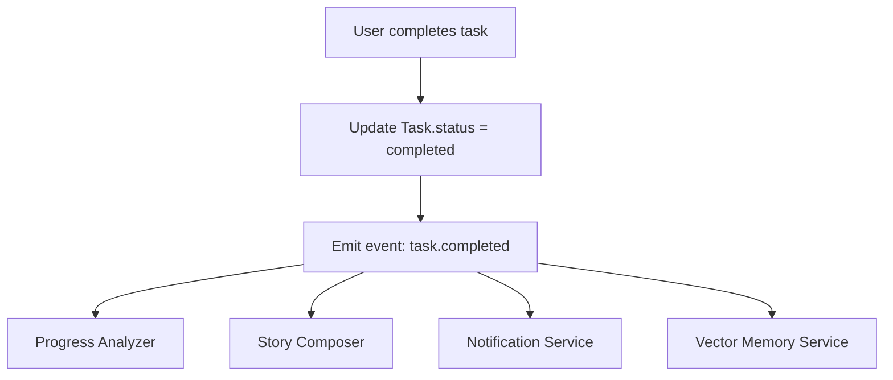

# Implementation Plan: AI-Oriented Data Hooks for `TaskCompletedEvent`

## 🧭 Goal
Build an event-driven system that reacts to task completion and triggers multiple intelligent services:
1. Progress analysis
2. Media retrieval and story segment generation
3. Notification delivery
4. Semantic memory update via vector DB

This enhances personalization, storytelling, and AI learning across the platform.

---

## 📦 Architecture Summary



All subscribers consume the same `task.completed` event through a central event bus.

---

## ✅ Step-by-Step Implementation (Based on Current File Structure)

### 📁 apps/backend_api/event_bus.py
```python
from typing import Callable, Dict, List, Awaitable
from enum import Enum

class EventType(str, Enum):
    TASK_COMPLETED = "task.completed"

subscribers: Dict[EventType, List[Callable[[dict], Awaitable[None]]]] = {}

def subscribe(event_type: EventType, handler: Callable[[dict], Awaitable[None]]):
    subscribers.setdefault(event_type, []).append(handler)

async def publish(event_type: EventType, payload: dict):
    for handler in subscribers.get(event_type, []):
        await handler(payload)
```

---

### 📁 apps/backend_api/routers/tasks.py
```python
from ..event_bus import publish, EventType

@router.put("/tasks/{task_id}/complete")
async def mark_task_complete(task_id: UUID, db: Session = Depends(get_db)):
    task = db.query(Task).get(task_id)
    task.status = "completed"
    db.commit()

    await publish(EventType.TASK_COMPLETED, {"task_id": str(task.id), "user_id": str(task.user_id)})
    return {"detail": "Task marked as completed"}
```

---

### 📁 apps/backend_api/event_consumers.py
```python
from .event_bus import subscribe, EventType
from .db import SessionLocal
from .models import Task
from .services import progress, storytelling, notifications, memory

@subscribe(EventType.TASK_COMPLETED)
async def on_task_completed(payload):
    task_id = payload["task_id"]
    user_id = payload["user_id"]

    db = SessionLocal()
    task = db.query(Task).get(task_id)

    await progress.update_project_progress(db, task.project_id)
    await storytelling.enqueue_segment_generation(db, task)
    await notifications.send_completion_notification(user_id, task.title)
    await memory.index_task(task)
```

---

### 📁 apps/story_engine/storytelling.py
```python
async def enqueue_segment_generation(db, task):
    media = task.media_attachments
    story_text = f"User completed {task.title}. AI will now generate a story."
    db.story_sessions.add(story_text)  # Simplified
```

---

### 📁 apps/memory_service/memory.py
```python
from vector_db import embed_and_store

async def index_task(task):
    content = f"{task.title}. {task.description or ''}"
    await embed_and_store(task.id, content, {"user_id": str(task.user_id)})
```

---

### 📁 apps/notification_service/notifications.py
```python
from .push import send_push

async def send_completion_notification(user_id, task_title):
    await send_push(user_id, f"🎉 You completed '{task_title}'!")
```

---

### 📁 apps/backend_api/services/progress.py
```python
async def update_project_progress(db, project_id):
    # Calculate % based on completed tasks
    pass
```

---

### 📁 apps/backend_api/main.py
```python
from . import event_consumers  # Registers all subscriptions via decorators
```

---

## 📁 Directory Structure Overview
```
apps/
├── backend_api/
│   ├── event_bus.py
│   ├── event_consumers.py
│   ├── services/
│   │   ├── progress.py
├── story_engine/
│   ├── storytelling.py
├── notification_service/
│   ├── notifications.py
├── memory_service/
│   ├── memory.py
```

---

## 🔬 Testing Plan
- [ ] Unit test each handler independently
- [ ] Integration test task completion flow
- [ ] Mock embedding model for vector test
- [ ] Verify story segment and media inclusion
- [ ] Ensure notification is sent correctly

---

## 🧠 Vector Database Strategy

### Development (local):
Use **Weaviate** in Docker:
```yaml
# docker-compose.yml
weaviate:
  image: semitechnologies/weaviate:latest
  restart: always
  ports:
    - "8080:8080"
  environment:
    QUERY_DEFAULTS_LIMIT: 25
    AUTHENTICATION_ANONYMOUS_ACCESS_ENABLED: 'true'
    PERSISTENCE_DATA_PATH: '/var/lib/weaviate'
    DEFAULT_VECTORIZER_MODULE: 'none'
    ENABLE_MODULES: ''
```

### Production:
Use **Weaviate Cloud Service (WCS)** for scalability, managed SLA, and API-level reliability.
- Offload infrastructure complexity
- Scale with traffic
- Compatible with same Python client

---

## 🧠 Future Extensions
- Add event types for `project.completed`, `goal.reached`
- Replace in-process bus with Redis Streams or NATS
- Add `event_log` table for auditing or training signals

---

## ✅ Outcome
By implementing this architecture, SelfOS becomes:
- Proactive and modular
- Ready for personalization and storytelling
- Scalable toward future AI training and memory